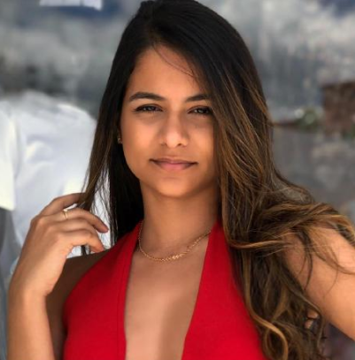
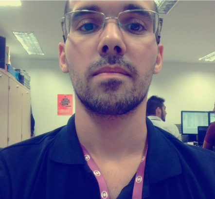
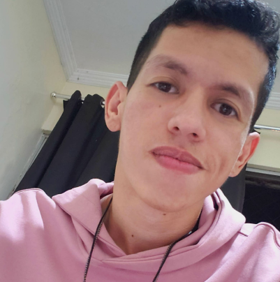
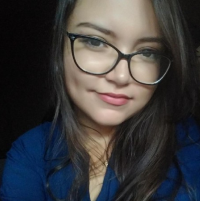
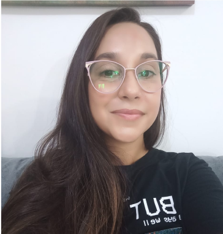

<h1 align="center"># Fshare - Squad 7</h1>

<p align="center">Aplicação desenvolvida pelo Squad 7 durante o programa de formação da FCamara.</p>

<h1 align="center">
 
</h1>

<ol>
    <li><a href="#sobre">Sobre</a></li>
        <li> <a href="#apresentacao">Apresentação</a></li>
        <li> <a href="#comecando">Começando</a> </li>
        <li> <a href="#deploy">Deploy</a> </li>
        <li> <a href="#construidocom">Construido com</a> </li>
        <li> <a href="#features">Futuras Features</a></li>
        <li> <a href="#autores">Autores</a></li>
        <li><a href="#licenca">Licença</a></li>
    <li><a href="#agradecimentos">Agradecimentos</a></li>
</ol>

<h2 id="sobre">Sobre</h2> 

O Fshare foi um projeto desenvolvido pelo Squad 7 para o Hackathon do Programa de Formação da [FCamara](https://digital.fcamara.com.br/programadeformacao). O objetivo desse projeto foi a construção de uma ferramenta que possa auxiliar na hora de procurar um profissional ideal para sua área de estudo e ter a oportunidade de agendar desde um bate-papo mais rápido até uma mentoria mais complexa, onde vocês poderão trocar conhecimentos. No Fshare, pessoas com diferentes níveis de experiência poderão se encontrar para trocar experiências, sanar dúvidas e criar networking, sempre priorizando o aprendizado. Todos podem mentorar nas áreas de conhecimento que dominam e podem ser ajudado por outros. 

<h2 id="apresentacao">🎥 Apresentação</h2> 
<p align="left">Confira alguns vídeos preparados para esta aplicação</p>

- [Vídeo Pitch](https://youtu.be/99XvuKPWrVc)
- [Vídeo demonstrativo](https://youtu.be/sP98huacezA)

<h2 id="comecando">🚀 Começando</h2> 

### 📋 Pré-requisitos

- NodeJs
	- NodeJs pode ser baixado através do [site oficial](https://nodejs.org/en/).
- Yarn
	- a instalaçao do yarn pode ser feita com o comando abaixo, após ter instalado o NodeJs. 
```bash
npm install --global yarn
```

### 🔧 Instalação

Baixe o repo na sua pasta de projetos através do comando abaixo:
```bash
# Clone o projeto
$ git clone https://github.com/erickystn/TechnicalShare.git
```

Para o backend:

```bash
# Acesse a pasta clonada
$ cd TechnicalShare/backend

# Instale as dependências
$ npm install

# Execute o projeto
$ npm run dev

# A Aplicação iniciará em http://localhost:3001
```

Para o frontend:
```bash
# Acesse a pasta clonada
$ cd TechnicalShare/frontend

# Instale as dependências
$ yarn

# Execute o projeto
$ yarn start

# A Aplicação iniciará em http://localhost:3000
```

<h2 id="deploy">📦 Deploy</h2> 

Fshare também possui uma versão em produção hospedado no [Heroku](http://heroku.com/) que você pode conferir pelo [link](https://fshare-front.herokuapp.com)


<h2 id="construidocom">🛠️ Construído com</h2> 

Algumas ferramentas que foram utilizadas para o desenvolvimento desse projeto fora: 

* [ReactJs](https://reactjs.org) - Biblioteca de front-end.
* [NodeJs](https://nodejs.org/en/) - Runtime Javascript para back-end.
* [PostgresSQL](https://www.postgresql.org) - Banco de dados relacional.
* [Sequelize](https://sequelize.org) - ORM para NodeJs.
* [ChakraUI](https://chakra-ui.com) - Biblioteca de componentes estilizados.
* [Bootstrap](https://react-bootstrap.github.io) - Framework front-end para estilização
 
<h2 id="features">⚙️ Futuras Features</h2> 

- Acrescentar a funcionalidade “FastShare”, com chats para dúvidas pontuais;
- Realizar pesquisas de satisfação dos usuários sobre a plataforma;
- Fazer o mapeamento das habilidades dos colaboradores e aprimorar os filtros;
- Possibilitar uma trilha de desenvolvimento personalizada com possibilidades de aprendizado a longo prazo;
- Implementar um histórico de mentorias e lista individual de favoritos.

<h2 id="autores">✒️ Autores</h2> 

|:woman_cartwheeling:|Nome|*No Programa de Formação eu...*|Contatos|
|--|--|:--:|--|
|<br>*Desenvolvedora Back-end*| Bruna Torres| *"...vi o quanto é transformador participar de um Hackathon. Aprender uma tecnologia do zero em um período de tempo tão curto e conhecer/trabalhar com pessoas nunca vistas torna tudo ainda mais incrível e desafiador. Cada dia é essencial e após 15 dias já parece que se passaram semanas hahah"* | [Github](https://github.com/bruninhaltorres) [Linkedin](https://www.linkedin.com/mwlite/in/bruninhaltorres) |
| <br>*Desenvolvedor Back-end* | Erick Braga | *"... nunca imaginei que conseguiria entrar e me desenvolver tão rápido a ponto de poder ensinar algumas coisas, perdi no inicio do Hackton 2 dias estudando praticamente 24 horas porque eu me sentia aquém do grupo principal em conhecimento, e foi uma virada de chave eu me ver sozinho no back depois da saída de um companheiro, e depois me ver tendo que desenvolver didática para passar isso para outra pessoa. Também aprendi a importância de não se trabalhar sozinho e ter apoio de uma equipe que estava ali sempre disposta a ajudar no que precisasse, seja dando ideias, seja dando apoio."* | [Github](https://github.com/erickystn) [Linkedin](https://www.linkedin.com/in/erick-santana-9240b0b1/) |
|<br>*Desenvolvedor Front-end*| Elienai Soares | *"...vi que participar do Programa de Formação FCamara com certeza foi uma das melhores experiências que tive, construir uma aplicação do zero com um time me mostrou o quão importante é o trabalho em equipe e saber se comunicar, foram 15 dias de aprendizados e conversas que acrescentaram muito para mim em todos os aspectos."* | [Github](https://github.com/NaySoares) [Linkedin](https://linkedin.com/in/elienai-soares) |
| <br>*Desenvolvedora Front-end* | Gislaine Costa | *"...tive a oportunidade de trabalhar no meu primeiro projeto e foi algo realmente desafiador pra se fazer em 15 dias. Foi um período em que aprendi bastante, principalmente sobre o dia a dia dev e só tenho a agradecer aos meus colegas de Squad e à FCamara pela experiência."* | [Linkedin](https://www.linkedin.com/in/gislaine-costa-cerqueira/) |
| <br>*UX Designer* | Glaucia Dias | *"...percebi como é importante a colaboração em equipe e como a gente pode complementar e aprender com o trabalho do outro. Também consegui ver melhor aquilo que preciso melhorar e me desafiar a colocar na prática as teorias. Sinto muita gratidão por poder participar desse momento tão enriquecedor"* | [Linkedin](https://www.linkedin.com/in/glaucia-dias-ux/) |


<h2 id="licenca">📄 Licença</h2> 

Este projeto está sob a licença MIT.

<h2 id="agradecimentos">🎁 Agradecimentos</h2> 

* Agradecimentos especiais a todos os mentores da [FCamara](https://www.fcamara.com.br) que nos guiaram e apoiaram durante este projeto.

---
com ❤️ por **Squad 7** da Season 3 - FCamara😊
