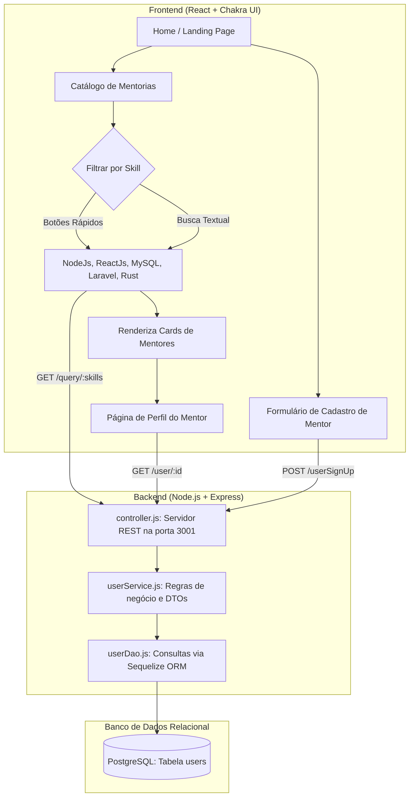
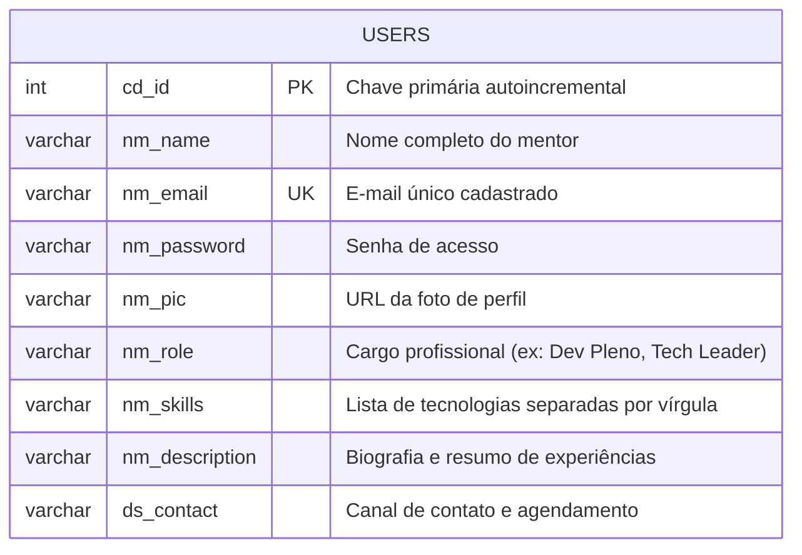
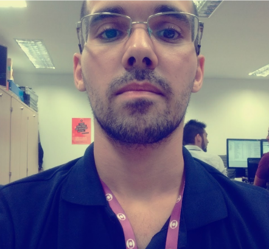

<h1 align="center">Fshare — Technical Share (Squad 7)</h1>

<p align="center">Aplicação desenvolvida pelo Squad 7 durante o programa de formação da FCamara (Season 3).</p>

<br />

<div align="center">

[](https://reactjs.org/)
[](https://nodejs.org/)
[](https://expressjs.com/)
[](https://sequelize.org/)
[](https://www.postgresql.org/)
[](https://chakra-ui.com/)
[](https://www.fcamara.com.br/)
[](LICENSE)
[](#)

</div>

---

<details open>
  <summary><strong>🖥️ Visualização da Interface da Aplicação</strong></summary>

  <br />

  <div align="center">
    
  </div>

</details>

---

<ol>
    <li><a href="#sobre">Sobre</a></li>
    <li><a href="#apresentacao">Apresentação</a></li>
    <li><a href="#comecando">Começando</a></li>
    <li><a href="#deploy">Deploy</a></li>
    <li><a href="#construidocom">Construido com</a></li>
    <li><a href="#arquitetura">Arquitetura e Fluxo</a></li>
    <li><a href="#endpoints">Endpoints da API</a></li>
    <li><a href="#features">Futuras Features</a></li>
    <li><a href="#autores">Autores</a></li>
    <li><a href="#licenca">Licença</a></li>
    <li><a href="#agradecimentos">Agradecimentos</a></li>
</ol>

---

<h2 id="sobre">Sobre</h2> 

O Fshare foi um projeto desenvolvido pelo Squad 7 para o Hackathon do Programa de Formação da [FCamara](https://digital.fcamara.com.br/programadeformacao). O objetivo desse projeto foi a construção de uma ferramenta que possa auxiliar na hora de procurar um profissional ideal para sua área de estudo e ter a oportunidade de agendar desde um bate-papo mais rápido até uma mentoria mais complexa, onde vocês poderão trocar conhecimentos. No Fshare, pessoas com diferentes níveis de experiência poderão se encontrar para trocar experiências, sanar dúvidas e criar networking, sempre priorizando o aprendizado. Todos podem mentorar nas áreas de conhecimento que dominam e podem ser ajudado por outros. 

---

<h2 id="apresentacao">🎥 Apresentação</h2> 
<p align="left">Confira alguns vídeos preparados para esta aplicação:</p>

- [Vídeo Pitch](https://youtu.be/99XvuKPWrVc)
- [Vídeo demonstrativo](https://youtu.be/sP98huacezA)

---

<h2 id="comecando">🚀 Começando</h2> 

### 📋 Pré-requisitos

- NodeJs
	- NodeJs pode ser baixado através do [site oficial](https://nodejs.org/en/).
- Yarn
	- a instalaçao do yarn pode ser feita com o comando abaixo, após ter instalado o NodeJs. 
```bash
npm install --global yarn
```

### 🔧 Instalação

Baixe o repo na sua pasta de projetos através do comando abaixo:
```bash
# Clone o projeto
$ git clone https://github.com/erickystn/Squad7-FShare.git
```

Para o backend:

```bash
# Acesse a pasta clonada
$ cd Squad7-FShare/backend

# Instale as dependências
$ npm install

# Execute o projeto
$ npm run dev

# A Aplicação iniciará em http://localhost:3001
```

Para o frontend:
```bash
# Acesse a pasta clonada
$ cd Squad7-FShare/frontend

# Instale as dependências
$ yarn

# Execute o projeto
$ yarn start

# A Aplicação iniciará em http://localhost:3000
```

### 🔐 Configuração de Ambiente do Backend (`.env`)

Crie um arquivo `.env` dentro da pasta `backend/` com as credenciais do PostgreSQL:

```env
DB_HOST=localhost
DB_USER=seu_usuario
DB_PASS=sua_senha
DB_NAME=fshare_db
PORT=3001
```

---

<h2 id="deploy">📦 Deploy</h2> 

Fshare também possui uma versão em produção hospedado no [Heroku](http://heroku.com/) que você pode conferir neste [link](https://fshare-front.herokuapp.com).

---

<h2 id="construidocom">🛠️ Construído com</h2> 

Algumas ferramentas que foram utilizadas para o desenvolvimento desse projeto: 

* [ReactJs](https://reactjs.org) - Biblioteca de front-end.
* [NodeJs](https://nodejs.org/en/) - Runtime Javascript para back-end.
* [PostgreSQL](https://www.postgresql.org) - Banco de dados relacional.
* [Sequelize](https://sequelize.org) - ORM para NodeJs.
* [ChakraUI](https://chakra-ui.com) - Biblioteca de componentes estilizados.
* [Bootstrap](https://react-bootstrap.github.io) - Framework front-end para estilização.

---

<h2 id="arquitetura">🏛️ Arquitetura e Fluxo da Aplicação</h2>

O ecossistema **FShare** opera sob uma arquitetura full-stack desacoplada:


```mermaid
flowchart TD
    subgraph FRONTEND["Frontend (React + Chakra UI)"]
        A[Home / Landing Page] --> B[Catálogo de Mentorias]
        B --> C{Filtrar por Skill}
        C -- Botões Rápidos --> D[NodeJs, ReactJs, MySQL, Laravel, Rust]
        C -- Busca Textual --> D
        D --> E[Renderiza Cards de Mentores]
        E --> F[Página de Perfil do Mentor]
        A --> G[Formulário de Cadastro de Mentor]
    end

    subgraph BACKEND["Backend (Node.js + Express)"]
        H[controller.js: Servidor REST na porta 3001]
        I[userService.js: Regras de negócio e DTOs]
        J[userDao.js: Consultas via Sequelize ORM]
    end

    subgraph DATABASE["Banco de Dados Relacional"]
        K[(PostgreSQL: Tabela users)]
    end

    D -- GET /query/:skills --> H
    F -- GET /user/:id --> H
    G -- POST /userSignUp --> H
    H --> I --> J --> K
```

### Modelagem de Dados (DER)


```mermaid
erDiagram
    USERS {
        int cd_id PK "Chave primária autoincremental"
        varchar nm_name "Nome completo do mentor"
        varchar nm_email UK "E-mail único cadastrado"
        varchar nm_password "Senha de acesso"
        varchar nm_pic "URL da foto de perfil"
        varchar nm_role "Cargo profissional (ex: Dev Pleno, Tech Leader)"
        varchar nm_skills "Lista de tecnologias separadas por vírgula"
        varchar nm_description "Biografia e resumo de experiências"
        varchar ds_contact "Canal de contato e agendamento"
    }
```

---

<h2 id="endpoints">📡 Tabela de Endpoints da API (Backend)</h2>

| Método | Rota | Descrição da Operação |
| :---: | :--- | :--- |
| `POST` | `/userSignUp` | Cadastra um novo profissional/mentor na plataforma. |
| `GET` | `/users` | Retorna a lista completa de mentores cadastrados. |
| `GET` | `/query/:skills` | Filtra e retorna mentores que possuem a tecnologia pesquisada. |
| `GET` | `/user/:id` | Retorna as informações detalhadas do perfil do mentor especificado por ID. |

---

<h2 id="estrutura">📂 Estrutura de Diretórios</h2>

```bash
Squad7-FShare/
├── .github/                                   # Ativos visuais do repositório (banner fshare.png)
├── assets/                                    # Imagens da equipe e da documentação
│   └── images/                                # Fotos dos autores do Squad 7
├── backend/                                   # Camada de serviços e API REST
│   ├── controller.js                          # Configuração de rotas Express e CORS
│   ├── db.js                                  # Conexão do Sequelize com o PostgreSQL
│   ├── insertManual.js                        # Script de seed de dados com usuários de teste
│   ├── models/user.js                         # Definição do modelo de dados Sequelize
│   ├── dao/userDao.js                         # Camada de acesso a dados
│   ├── service/userService.js                 # Lógica de negócio e transformação de skills
│   └── package.json
├── frontend/                                  # Interface Single Page Application
│   ├── src/
│   │   ├── components/                        # Cards de Mentores, ButtonSkill, Navbar, Footer
│   │   ├── pages/                             # Home, Mentorias, Cadastrar, Perfil, Skills
│   │   ├── routes/                            # Roteamento central e RouteWrapper
│   │   ├── services/                          # Integração HTTP com Axios
│   │   └── App.js                             # Componente raiz com ChakraProvider
│   └── package.json
└── README.md                                  # Documentação técnica do projeto
```

---

<h2 id="features">⚙️ Futuras Features</h2> 

- [ ] Acrescentar a funcionalidade “FastShare”, com chats para dúvidas pontuais;
- [ ] Realizar pesquisas de satisfação dos usuários sobre a plataforma;
- [ ] Fazer o mapeamento das habilidades dos colaboradores e aprimorar os filtros;
- [ ] Possibilitar uma trilha de desenvolvimento personalizada com possibilidades de aprendizado a longo prazo;
- [ ] Implementar um histórico de mentorias e lista individual de favoritos.

---

<h2 id="autores">✒️ Autores</h2> 

Participaram desse projeto (Squad 7 — Season 3 FCamara):

- [**Erick Braga**](https://github.com/erickystn) — Desenvolvedor Back-end
- [**Bruna Torres**](https://github.com/bruninhaltorres) — Desenvolvedora Back-end
- [**Gislaine Costa**](https://github.com/gih-costa) — Desenvolvedora Front-end
- [**Elienai Soares**](https://github.com/NaySoares) — Desenvolvedor Front-end
- [**Glaucia Dias**](https://www.linkedin.com/in/glaucia-dias-ux/) — UX/UI

<br />

<details>
  <summary><strong>👥 Fotos dos Integrantes da Equipe</strong></summary>

  <br />

  <div align="center">
    
    
    
    
    
  </div>

</details>

---

<h2 id="licenca">📄 Licença</h2> 

Este projeto está sob a licença **MIT**.

---

<h2 id="agradecimentos">🎁 Agradecimentos</h2> 

* Agradecimentos especiais a todos os mentores da [FCamara](https://www.fcamara.com.br) que nos guiaram e apoiaram durante este projeto.

---
com ❤️ por **Squad 7** da Season 3 - FCamara😊
